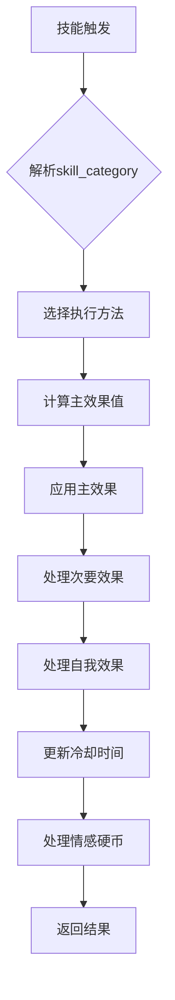
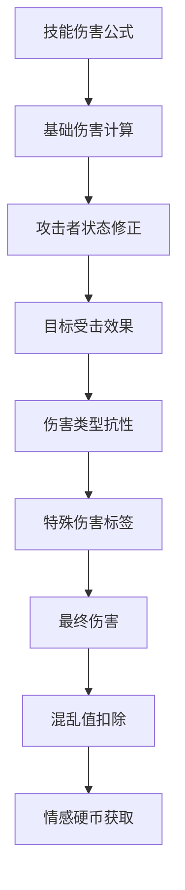

# SimpleBot 技能系统完整开发文档

## 📋 目录
- [系统架构概述](#系统架构概述)
- [技能分类体系](#技能分类体系)
- [次要效果系统](#次要效果系统)
- [目标解析系统](#目标解析系统)
- [伤害计算机制](#伤害计算机制)
- [状态效果详解](#状态效果详解)
- [情感硬币系统](#情感硬币系统)
- [技能配置JSON](#技能配置json)
- [技能管理系统](#技能管理系统)
- [实战配置示例](#实战配置示例)

---

## 🏗️ 系统架构概述

SimpleBot技能系统采用**高度模块化**的设计，核心由以下组件构成：

### 核心组件架构

```
SkillEffect (抽象基类)
├── execute() - 主执行入口，根据skill_category分发
├── execute_damage() - 单体伤害技能
├── execute_healing() - 单体治疗技能  
├── execute_buff() - 单体增益技能
├── execute_debuff() - 单体减益技能
├── execute_self() - 自我强化技能
├── execute_aoe_damage() - AOE伤害技能
├── execute_aoe_healing() - AOE治疗技能
├── execute_aoe_buff() - AOE增益技能
└── execute_aoe_debuff() - AOE减益技能
```

### 设计理念

1. **主次效果分离**：`skill_category`决定主要功能，`effects` JSON控制次要效果
2. **目标独立解析**：每个效果可独立指定作用目标
3. **动态数值计算**：支持固定数值和基于主效果的百分比计算
4. **高级伤害系统**：包含伤害类型、抗性、特攻等复杂机制

---

## 🎯 技能分类体系

### 单体技能类

| 分类 | `skill_category` | 目标选择 | 主要功能 | 执行方法 |
|------|------------------|----------|----------|----------|
| 🔥 **伤害技能** | `damage` | 需选择敌方 | 造成伤害 | `execute_damage()` |
| 💚 **治疗技能** | `healing` | 需选择友方 | 恢复生命值 | `execute_healing()` |
| ✨ **增益技能** | `buff` | 需选择友方 | 添加正面状态 | `execute_buff()` |
| 💀 **减益技能** | `debuff` | 需选择敌方 | 添加负面状态 | `execute_debuff()` |
| 🧘 **自我强化** | `self` | 无需选择 | 只对施法者生效 | `execute_self()` |

### AOE群体技能类

| 分类 | `skill_category` | 目标选择 | 主要功能 | 执行方法 |
|------|------------------|----------|----------|----------|
| 💥 **群体伤害** | `aoe_damage` | 自动选择所有敌方 | 对所有敌方造成伤害 | `execute_aoe_damage()` |
| 🌿 **群体治疗** | `aoe_healing` | 自动选择所有友方 | 治疗所有友方 | `execute_aoe_healing()` |
| 🌟 **群体增益** | `aoe_buff` | 自动选择所有友方 | 为所有友方添加增益 | `execute_aoe_buff()` |
| ☠️ **群体减益** | `aoe_debuff` | 自动选择所有敌方 | 为所有敌方添加减益 | `execute_aoe_debuff()` |

### 技能执行流程



---

## ⚡ 次要效果系统

次要效果通过`effects` JSON字段定义，支持复杂的组合效果：

### 📊 效果类型表

| 效果类型 | JSON键 | 功能说明 | 支持参数 |
|---------|--------|---------|---------|
| 🎭 **状态效果** | `status` | 添加增益/减益状态 | `effect`, `turns`, `value`, `target` |
| ⚔️ **伤害效果** | `damage` | 造成额外伤害 | `amount`/`percentage`, `target` |
| 💖 **治疗效果** | `heal` | 恢复生命值 | `amount`/`percentage`, `target` |
| 🔥 **自我伤害** | `self_damage` | 对施法者造成伤害 | `amount`/`percentage` |
| 💚 **自我治疗** | `self_heal` | 为施法者恢复生命值 | `amount`/`percentage` |

### 状态效果配置

```json
{\n  \"status\": [\n    {\n      \"effect\": \"strong\",     // 状态类型\n      \"turns\": 3,            // 持续回合\n      \"value\": 2,            // 强度/层数\n      \"target\": \"self\"       // 目标类型\n    }\n  ]\n}
```

### 数值计算规则

#### 固定数值
```json
{\n  \"damage\": {\n    \"amount\": 25,           // 固定25点伤害\n    \"target\": \"skill_target\"\n  }\n}
```

#### 百分比计算
```json
{\n  \"heal\": {\n    \"percentage\": 15,       // 主效果的15%\n    \"target\": \"all_allies\"\n  }\n}
```

**计算公式**：
- `amount`优先级高于`percentage`
- 百分比基于主效果的**实际数值**（考虑攻防修正后）
- `final_value = main_effect_value × percentage ÷ 100`

---

## 🎯 目标解析系统

### EffectTargetResolver类

目标解析系统统一处理所有效果的目标选择逻辑：

| 目标类型 | 代码 | 解析结果 | 使用场景 |
|---------|------|---------|---------|
| 🎯 **技能目标** | `skill_target` | 主效果选中的目标 | 单体技能的连击效果 |
| 🧘 **施法者** | `self` | 施法者自己 | 技能反馈、自我增益 |
| 👥 **所有友方** | `all_allies` | 同阵营所有角色 | 团队支援效果 |
| 🏹 **所有敌方** | `all_enemies` | 敌对阵营所有角色 | 群体控制效果 |
| 🌍 **所有角色** | `all_characters` | 战场上所有角色 | 环境效果 |

### 目标解析机制

```python
# 核心解析逻辑
def resolve_target(self, target_type, attacker, skill_target=None):
    if target_type == 'self':
        return [attacker]
    elif target_type == 'skill_target':
        return [skill_target] if skill_target else [attacker]
    elif target_type == 'all_allies':
        return get_characters_by_type(attacker['character_type'], in_battle=True)
    # ... 其他类型
```

---

## ⚔️ 伤害计算机制

### 高级伤害计算流程



### 伤害计算公式

```
最终伤害 = ((基础伤害 + 攻击修正 - 防御修正) × 状态修正 × 抗性修正) × 特攻修正
```

### 伤害类型系统

| 伤害类型 | `damage_type` | 图标 | 说明 |
|---------|---------------|------|------|
| **物理伤害** | `physical` | ⚔️ | 受物理抗性影响 |
| **魔法伤害** | `magical` | 🔮 | 受魔法抗性影响 |

### 特殊伤害标签

通过`special_damage_tags` JSON字段定义特攻效果：

```json
{\n  \"special_damage_tags\": {\n    \"强攻\": [\"不死族\", \"龙族\"],    // 对特定种族造成额外伤害\n    \"元素克制\": [\"火系\", \"冰系\"]      // 元素克制关系\n  }\n}
```

---

## 🌟 状态效果详解

### 增益状态 (Buffs)

| 状态 | 代码 | 效果机制 | 层数效果 | 触发时机 |
|------|------|---------|---------|---------|
| 💪 **强壮** | `strong` | 攻击伤害增加 | 每层+10%伤害 | 造成伤害时 |
| 🔰 **守护** | `guard` | 受到伤害减少 | 每层-10%伤害 | 受到攻击时 |
| ✨ **呼吸法** | `breath` | 提升暴击率和暴击伤害 | 每层+1%暴击率 | 造成伤害时 |
| 🛡️ **护盾** | `shield` | 优先抵消护盾值 | 护盾值耗尽后消失 | 受到攻击时 |
| ⚡ **加速** | `speed` | 增加行动次数 | 立即获得额外行动 | 回合开始时 |

### 减益状态 (Debuffs)

| 状态 | 代码 | 效果机制 | 层数效果 | 触发时机 |
|------|------|---------|---------|---------|
| 🔥 **烧伤** | `burn` | 持续伤害 | 每回合扣除层数×1点生命值 | 回合结束 |
| 🧪 **中毒** | `poison` | 百分比持续伤害 | 每回合扣除层数×1%最大生命值 | 回合结束 |
| 💔 **破甲** | `crack` | 受到伤害增加 | 每层+10%受伤 | 受到攻击时 |
| 🩸 **流血** | `bleed` | 行动时触发伤害 | 行动时扣除层数×2点生命值 | 行动开始时 |
| 😵 **虚弱** | `weak` | 攻击伤害减少 | 每层-10%伤害 | 造成伤害时 |
| 🎯 **易伤** | `vulnerable` | 受到伤害大幅增加 | 每层+15%受伤 | 受到攻击时 |

### 状态效果机制

```python
# 状态添加示例
add_status_effect(\n    character_id=target_id,\n    effect_type='buff',      # 'buff' 或 'debuff'\n    effect_name='strong',    # 状态名称\n    intensity=2,             # 强度/层数\n    duration=3               # 持续回合数\n)
```

**重要机制**：
- **层数叠加**：相同状态可以叠加，最大99层
- **持续时间**：每回合结束时自动减少1回合
- **触发优先级**：增益状态优先于减益状态处理

---

## 🎭 情感硬币系统

### 获取规则

#### 伤害相关
```python
# 造成伤害：获得正面硬币
positive_coins = 1  # 基础1个
if target_died:\n    positive_coins += 2  # 击杀额外奖励

# 受到伤害：获得负面硬币  
negative_coins = 1  # 基础1个
```

#### 治疗相关
```python
# 治疗者：获得正面硬币
healer_coins = 1  # 基础1个

# 被治疗者：获得正面硬币（如果不是自愈）
if healer_id != target_id:\n    target_coins = 1  # 基础1个
```

#### 骰子相关
```python
# 基于骰子结果获得硬币
# 大成功（最大值）：正面硬币
# 大失败（1）：负面硬币
positive_coins, negative_coins = EmotionSystem.get_emotion_coins_from_dice_roll(\n    dice_results, dice_sides\n)
```

### 情感升级机制

情感硬币会触发角色的情感等级提升，解锁新的技能和能力。

---

## 📝 技能配置JSON

### 完整技能结构

```json
{\n  \"id\": 101,\n  \"name\": \"炽焰斩\",\n  \"description\": \"火焰缠绕的强力斩击，对目标造成物理伤害并施加烧伤\",\n  \"skill_category\": \"damage\",\n  \"damage_formula\": \"2d8+15\",\n  \"damage_type\": \"physical\",\n  \"special_damage_tags\": {\n    \"烈火\": [\"冰系\", \"植物系\"]\n  },\n  \"effects\": {\n    \"status\": [\n      {\n        \"effect\": \"burn\",\n        \"turns\": 4,\n        \"value\": 6,\n        \"target\": \"skill_target\"\n      },\n      {\n        \"effect\": \"strong\",\n        \"turns\": 3,\n        \"value\": 2,\n        \"target\": \"self\"\n      }\n    ],\n    \"heal\": {\n      \"target\": \"self\",\n      \"percentage\": 10\n    }\n  },\n  \"cooldown\": 3,\n  \"required_emotion_level\": 2\n}
```

### 字段详解

| 字段 | 类型 | 必需 | 说明 |
|------|------|------|------|
| `id` | int | ✅ | 技能唯一标识符 |
| `name` | string | ✅ | 技能名称 |
| `description` | string | ✅ | 技能描述 |
| `skill_category` | string | ✅ | 技能分类（主效果类型） |
| `damage_formula` | string | ❌ | 伤害/治疗公式（如\"2d6+8\"） |
| `damage_type` | string | ❌ | 伤害类型（physical/magical） |
| `special_damage_tags` | JSON | ❌ | 特殊伤害标签和目标种族 |
| `effects` | JSON | ❌ | 次要效果配置 |
| `cooldown` | int | ✅ | 冷却回合数 |
| `required_emotion_level` | int | ❌ | 所需情感等级 |

---

## 🔧 技能管理系统

### 命令接口

| 命令 | 格式 | 功能 | 示例 |
|------|------|------|------|
| `/sm` | `/sm <角色名>` | 进入技能管理界面 | `/sm 火焰法师` |
| `/skills` | `/skills <角色名>` | 查看角色技能列表 | `/skills 圣骑士` |

### 管理功能

#### 批量操作
- **批量添加技能**：多选技能一次性添加
- **批量移除技能**：多选技能一次性移除
- **实时预览**：选中的技能会实时显示状态

#### 单个操作
- **添加单个技能**：逐个精确添加技能
- **移除单个技能**：逐个移除技能（普通攻击不可移除）

### 技能数据库操作

```python
# 获取角色技能
character_skills = get_character_skills(character_id)

# 添加技能到角色
success = add_skill_to_character(character_id, skill_id)

# 从角色移除技能
success = remove_skill_from_character(character_id, skill_id)

# 获取所有可用技能
all_skills = get_all_skills()
```

---

## 🛠️ 实战配置示例

### 示例1：复合攻击技能

```json
{\n  \"name\": \"雷霆斩击\",\n  \"skill_category\": \"damage\",\n  \"description\": \"雷电缠绕的斩击，造成魔法伤害并麻痹目标\",\n  \"damage_formula\": \"3d6+12\",\n  \"damage_type\": \"magical\",\n  \"special_damage_tags\": {\n    \"雷击\": [\"水系\", \"金属系\"]\n  },\n  \"effects\": {\n    \"status\": [\n      {\n        \"effect\": \"vulnerable\",\n        \"turns\": 3,\n        \"value\": 2,\n        \"target\": \"skill_target\"\n      }\n    ],\n    \"damage\": {\n      \"target\": \"all_enemies\",\n      \"percentage\": 20\n    },\n    \"self_heal\": {\n      \"percentage\": 15\n    }\n  },\n  \"cooldown\": 4\n}
```

**执行流程分析**：
1. 对选中目标造成`3d6+12`点魔法伤害
2. 给目标添加易伤状态（3回合，受伤+30%）
3. 对所有敌方造成主伤害20%的连锁伤害
4. 为自己恢复主伤害15%的生命值

### 示例2：群体支援技能

```json
{\n  \"name\": \"战神祝福\",\n  \"skill_category\": \"aoe_buff\",\n  \"description\": \"召唤战神力量强化全队\",\n  \"effects\": {\n    \"status\": [\n      {\n        \"effect\": \"strong\",\n        \"turns\": 6,\n        \"value\": 3,\n        \"target\": \"all_allies\"\n      },\n      {\n        \"effect\": \"guard\",\n        \"turns\": 6,\n        \"value\": 2,\n        \"target\": \"all_allies\"\n      },\n      {\n        \"effect\": \"speed\",\n        \"turns\": 2,\n        \"value\": 1,\n        \"target\": \"all_allies\"\n      }\n    ],\n    \"heal\": {\n      \"target\": \"all_allies\",\n      \"amount\": 25\n    }\n  },\n  \"cooldown\": 8\n}
```

**执行流程分析**：
1. 为所有友方添加强壮状态（6回合，攻击力+30%）
2. 为所有友方添加守护状态（6回合，受伤-20%）
3. 为所有友方添加加速状态（2回合，额外行动机会）
4. 为所有友方恢复25点生命值

### 示例3：风险收益技能

```json
{\n  \"name\": \"血祭法术\",\n  \"skill_category\": \"aoe_damage\",\n  \"description\": \"以生命为代价释放强大的群体攻击\",\n  \"damage_formula\": \"4d8+20\",\n  \"damage_type\": \"magical\",\n  \"effects\": {\n    \"status\": [\n      {\n        \"effect\": \"burn\",\n        \"turns\": 5,\n        \"value\": 8,\n        \"target\": \"all_enemies\"\n      }\n    ],\n    \"self_damage\": {\n      \"percentage\": 30\n    },\n    \"heal\": {\n      \"target\": \"all_allies\",\n      \"percentage\": 25\n    }\n  },\n  \"cooldown\": 6\n}
```

**执行流程分析**：
1. 对所有敌方造成`4d8+20`点魔法伤害
2. 给所有敌方添加烧伤状态（5回合，每回合8点伤害）
3. 对自己造成总伤害30%的反噬伤害
4. 为所有友方恢复总伤害25%的生命值

### 示例4：控制型技能

```json
{\n  \"name\": \"时空禁锢\",\n  \"skill_category\": \"debuff\",\n  \"description\": \"操控时空力量削弱目标\",\n  \"effects\": {\n    \"status\": [\n      {\n        \"effect\": \"weak\",\n        \"turns\": 4,\n        \"value\": 3,\n        \"target\": \"skill_target\"\n      },\n      {\n        \"effect\": \"vulnerable\",\n        \"turns\": 4,\n        \"value\": 2,\n        \"target\": \"skill_target\"\n      }\n    ],\n    \"damage\": {\n      \"target\": \"skill_target\",\n      \"amount\": 18\n    },\n    \"status\": [\n      {\n        \"effect\": \"cooldown_reduction\",\n        \"turns\": 1,\n        \"value\": 2,\n        \"target\": \"self\"\n      }\n    ]\n  },\n  \"cooldown\": 4\n}
```

**执行流程分析**：
1. 给目标添加虚弱状态（4回合，攻击力-30%）
2. 给目标添加易伤状态（4回合，受伤+30%）
3. 对目标造成18点固定伤害
4. 立即缩短自己2回合的技能冷却时间

---

## 📚 开发指南

### 创建新技能步骤

1. **设计技能概念**：确定技能的主要功能和风格
2. **选择技能分类**：根据主要功能选择`skill_category`
3. **设计伤害公式**：设定`damage_formula`和`damage_type`
4. **配置次要效果**：在`effects`中添加状态、治疗、伤害等效果
5. **平衡性测试**：调整数值确保游戏平衡
6. **数据库录入**：将技能数据插入skills表

### 平衡性建议

| 技能类型 | 伤害范围 | 治疗范围 | 状态持续 | 冷却时间 |
|---------|---------|---------|---------|---------|
| **单体攻击** | 15-35 | - | 3-5回合 | 1-3回合 |
| **单体治疗** | - | 20-40 | 3-6回合 | 2-4回合 |
| **AOE攻击** | 10-25 | - | 2-4回合 | 3-6回合 |
| **AOE治疗** | - | 15-30 | 4-6回合 | 4-8回合 |
| **纯控制** | 5-15 | - | 4-8回合 | 3-5回合 |

### 常见错误避免

❌ **错误**：AOE技能使用`skill_target`作为次要效果目标
✅ **正确**：AOE技能使用`all_enemies`或`all_allies`

❌ **错误**：百分比效果设置过高（>50%）
✅ **正确**：百分比效果控制在10%-30%范围

❌ **错误**：状态效果名称使用中文或大写
✅ **正确**：使用小写英文如`strong`、`burn`

---

## 📖 相关文档

- **玩家使用手册**：`PLAYER_SKILL_GUIDE.md`
- **快速参考**：`SKILL_SYSTEM_REFERENCE.md`  
- **系统概述**：`SYSTEM_DOCUMENTATION.md`
- **API文档**：`SIMPLEBOT_API.md`

---

*文档版本: v2.0*  
*最后更新: 2025年9月10日*  
*适用于: SimpleBot v2.0+*  
*作者: 系统开发团队*
