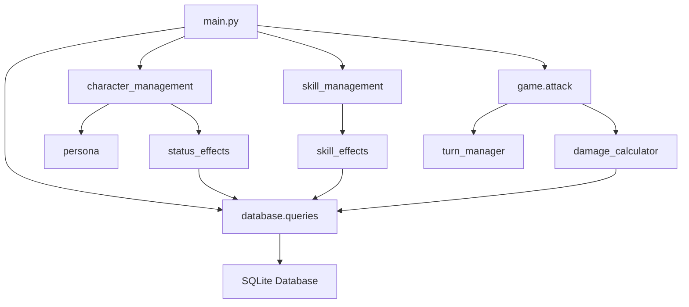

# SimpleBot 系统功能详细文档

## 目录
- [项目概述](#项目概述)
- [系统架构](#系统架构)  
- [核心功能模块](#核心功能模块)
- [用户使用指南](#用户使用指南)
- [开发者指南](#开发者指南)
- [API接口说明](#api接口说明)
- [数据库设计](#数据库设计)
- [部署与配置](#部署与配置)
- [扩展开发](#扩展开发)

---

## 项目概述

### 系统简介
SimpleBot是一个基于Python和Telegram Bot API开发的角色扮演游戏（RPG）战斗机器人。该系统专注于提供完整的回合制战斗体验，包含角色管理、技能系统、状态效果、种族系统等丰富功能。

### 技术栈
- **编程语言**: Python 3.8+
- **框架**: python-telegram-bot 20.x
- **数据库**: SQLite3
- **网络请求**: HTTPX
- **配置管理**: python-dotenv

### 设计理念
- **模块化架构**: 清晰的功能分离，易于维护和扩展
- **用户友好**: 丰富的交互界面和详细的反馈信息  
- **数据安全**: 完善的错误处理和数据验证
- **可扩展性**: 灵活的技能效果系统和数据库迁移机制

---

## 系统架构

### 目录结构
```
SimpleBot/
├── src/                          # 源代码目录
│   ├── main.py                   # 程序入口，Bot初始化和命令注册
│   ├── character/                # 角色管理模块
│   │   ├── __init__.py
│   │   ├── character_management.py   # 角色CRUD操作和命令处理
│   │   ├── race_management.py        # 种族系统和抗性管理
│   │   ├── persona_management.py     # 人格系统管理
│   │   ├── persona.py               # 人格核心逻辑
│   │   ├── stagger_manager.py       # 状态效果管理器
│   │   ├── status_effects.py        # 状态效果计算逻辑
│   │   └── status_formatter.py      # 状态显示格式化
│   ├── skill/                    # 技能系统模块
│   │   ├── __init__.py
│   │   ├── skill_management.py      # 技能分配和管理界面
│   │   ├── skill_effects.py         # 技能效果执行引擎
│   │   └── effect_target_resolver.py # 目标解析系统
│   ├── game/                     # 游戏逻辑模块
│   │   ├── attack.py                # 攻击系统和战斗流程
│   │   ├── damage_calculator.py     # 伤害计算引擎
│   │   └── turn_manager.py          # 回合管理系统
│   └── database/                 # 数据库模块
│       ├── db_connection.py         # 数据库连接管理
│       ├── queries.py               # SQL查询函数集合
│       ├── db_migration.py          # 数据库版本迁移
│       └── migrations/              # 迁移脚本目录
├── data/                         # 数据目录
│   └── simplebot.db             # SQLite数据库文件
├── docs/                        # 文档目录
│   ├── SIMPLEBOT_MANUAL.md      # 用户使用手册
│   ├── SIMPLEBOT_API.md         # 开发者API文档
│   └── *.md                     # 其他说明文档
├── requirements.txt             # Python依赖包列表
├── .env                        # 环境变量配置（需自行创建）
└── README.md                   # 项目说明文件
```

### 核心组件关系


---

## 核心功能模块

### 1. 角色管理系统 (`character/`)

#### 功能特性
- **角色创建与管理**: 支持创建友方和敌方角色，设置基础属性
- **生命值管理**: 动态修改角色当前生命值，支持治疗和伤害
- **战斗状态管理**: 角色加入/离开战斗，战斗状态查看
- **状态重置**: 单个或批量重置角色状态和生命值

#### 角色属性系统
| 属性名称 | 说明 | 默认值 | 作用 |
|---------|------|-------|------|
| max_health | 最大生命值 | 100 | 决定角色生存能力 |
| health | 当前生命值 | 100 | 角色当前状态 |
| attack | 物理攻击力 | 10 | 物理技能伤害加成 |
| defense | 物理防御力 | 5 | 物理伤害减免 |
| magic_attack | 魔法攻击力 | 10 | 魔法技能伤害加成 |
| magic_defense | 魔法防御力 | 5 | 魔法伤害减免 |
| actions_per_turn | 每回合行动次数 | 1 | 战斗中的行动频率 |

#### 种族系统
- **15种可选种族**: 人类、精灵、矮人、兽人、龙族、天使、恶魔、不死族、机械、元素、妖精、巨人、魔族、虫族、异界生物
- **抗性机制**: 支持物理抗性和魔法抗性设置(0-100%)
- **特攻系统**: 某些技能对特定种族造成额外伤害

#### 人格系统
- **核心角色**: 珏、露、莹、笙、曦五个核心角色支持多重人格
- **人格切换**: 每个核心角色拥有多个人格，可动态切换
- **人格专属属性**: 不同人格拥有独立的属性数值

### 2. 技能系统 (`skill/`)

#### 技能分类体系
| 分类 | 代码 | 说明 | 目标类型 |
|------|------|------|---------|
| 伤害技能 | damage | 对敌方造成伤害 | 敌方单体 |
| 治疗技能 | healing | 恢复友方生命值 | 友方单体 |
| 增益技能 | buff | 给友方添加正面状态 | 友方单体 |
| 减益技能 | debuff | 给敌方添加负面状态 | 敌方单体 |
| 自我技能 | self | 只对施法者生效 | 自己 |
| AOE伤害 | aoe_damage | 对所有敌方造成伤害 | 敌方全体 |
| AOE治疗 | aoe_healing | 治疗所有友方 | 友方全体 |
| AOE增益 | aoe_buff | 给所有友方添加增益 | 友方全体 |
| AOE减益 | aoe_debuff | 给所有敌方添加减益 | 敌方全体 |

#### 技能效果系统
技能效果分为**主效果**和**次要效果**：

**主效果**：由 `skill_category` 决定，影响目标选择和核心功能
```json
{
  "skill_category": "damage",
  "damage_formula": "15+1d8",
  "damage_type": "physical"
}
```

**次要效果**：在 `effects` JSON中定义，支持复杂组合
```json
{
  "status": [
    {
      "effect": "strong",
      "turns": 3,
      "value": 2,
      "target": "self"
    }
  ],
  "damage": {
    "target": "skill_target",
    "percentage": 30
  },
  "heal": {
    "target": "attacker",
    "amount": 25
  }
}
```

#### 百分比效果机制
- **percentage字段**: 基于主效果数值的百分比计算
- **动态计算**: 如主效果造成100点伤害，次要效果设置30%则造成30点伤害
- **灵活组合**: 可同时包含固定数值和百分比效果

#### 冷却系统
- **行动冷却**: 以"次行动"为单位计算冷却时间
- **全局缩减**: 每次使用技能会使所有技能冷却时间-1
- **策略深度**: 需要合理安排技能使用时机

### 3. 状态效果系统 (`character/status_effects.py`)

#### 增益状态(Buff)
| 状态名称 | 效果描述 | 触发时机 |
|---------|---------|---------|
| strong | 攻击伤害+(层数×10%) | 造成伤害时 |
| guard | 受到伤害-(层数×10%) | 受到攻击时 |
| breath | 暴击率+强度×1%，暴击倍率120% | 造成伤害时 |
| shield | 优先抵消护盾值，耗尽后移除 | 受到攻击时 |
| speed | 增加行动次数和冷却缩减 | 回合开始时 |

#### 减益状态(Debuff)
| 状态名称 | 效果描述 | 触发时机 |
|---------|---------|---------|
| burn | 每回合结束扣强度×1点血 | 回合结束 |
| poison | 每回合结束扣强度×1%最大生命值 | 回合结束 |
| crack | 受击时扣强度×1点血并减1层 | 受到攻击时 |
| bleed | 行动后扣强度×1点血并减1层 | 行动后 |
| weak | 攻击伤害-(层数×10%) | 造成伤害时 |
| vulnerable | 受到伤害+(层数×10%) | 受到攻击时 |

#### 状态管理机制
- **层数叠加**: 同名状态可叠加层数，最大99层
- **持续时间**: 按回合数计算，到期自动移除
- **触发顺序**: 严格按照时机顺序处理状态效果
- **交互关系**: 支持状态间的相互抵消和影响

### 4. 战斗系统 (`game/`)

#### 回合制战斗流程
1. **战斗准备**: 角色加入战斗，设置初始状态
2. **行动阶段**: 按照行动次数进行攻击或技能使用
3. **伤害计算**: 考虑属性、抗性、状态效果的综合伤害
4. **状态处理**: 触发各种状态效果的计算
5. **回合结束**: 处理回合结束事件，减少冷却时间

#### 伤害计算公式
```python
# 基础伤害
base_damage = roll_damage_dice(damage_formula)

# 属性加成
if damage_type == "physical":
    final_damage = base_damage + attacker_attack - target_defense
else:  # magical
    final_damage = base_damage + attacker_magic_attack - target_magic_defense

# 抗性减免
if damage_type == "physical":
    final_damage *= (1 - target_physical_resistance)
else:
    final_damage *= (1 - target_magic_resistance)

# 状态效果修正
final_damage = apply_status_effects(final_damage, attacker, target)
```

#### 目标选择系统
- **智能过滤**: 根据技能类型自动过滤可选目标
- **批量操作**: 支持AOE技能的全体目标处理
- **隐私保护**: 敏感选择过程通过私聊进行

### 5. 数据库系统 (`database/`)

#### 核心数据表
- `characters`: 角色基础信息和属性
- `skills`: 技能定义和效果配置
- `character_skills`: 角色技能关联表
- `character_status_effects`: 角色当前状态效果
- `character_cooldowns`: 技能冷却时间记录
- `personas`: 人格系统数据
- `battle_log`: 战斗历史记录

#### 迁移系统
- **版本管理**: 自动检测和应用数据库结构更新
- **平滑升级**: 保留现有数据的同时添加新功能
- **回滚支持**: 支持迁移失败时的数据恢复

---

## 用户使用指南

### 快速开始

#### 1. 基础操作
```
/start          # 启动机器人
/help           # 查看帮助信息
```

#### 2. 创建角色
```bash
# 创建友方角色
/create_character 艾丽丝 100 15 10 12 8
# 简写形式
/cc 艾丽丝 100 15 10 12 8

# 创建敌方角色  
/create_enemy 哥布林 80 12 8 5 6
# 简写形式
/ce 哥布林 80 12 8 5 6
```

#### 3. 角色管理
```bash
# 查看角色
/characters     # 查看所有友方角色
/enemies       # 查看所有敌方角色
/show 艾丽丝    # 查看具体角色详情

# 修改属性
/health 艾丽丝 80        # 设置生命值
/race 艾丽丝            # 设置种族和抗性
/set_actions 艾丽丝 2    # 设置每回合行动次数

# 重置状态
/reset 艾丽丝           # 重置单个角色
/reset_all             # 重置所有角色
```

#### 4. 战斗操作
```bash
# 战斗准备
/join 艾丽丝            # 单个角色加入战斗
/join 艾丽丝 鲍勃 卡洛尔  # 批量加入
/join all friendly     # 所有友方加入
/join all enemy        # 所有敌方加入

# 战斗进行
/attack               # 友方攻击/使用技能
/enemy_attack         # 敌方攻击/使用技能
/battle              # 查看战斗状态
/end_turn            # 结束当前回合

# 战斗结束
/leave 艾丽丝         # 单个角色离开
/end_battle          # 所有角色离开战斗
```

#### 5. 技能管理
```bash
/sm 艾丽丝            # 管理艾丽丝的技能
/skills              # 查看角色技能列表
```

#### 6. 高级功能
```bash
# 人格系统
/create_core 珏       # 创建核心角色
/personas 珏         # 查看可用人格
/persona 珏 默认      # 切换人格
/core_status         # 查看所有核心角色状态
```

### 战斗策略指南

#### 基础战术
1. **属性搭配**: 平衡攻击、防御、生命值的分配
2. **技能选择**: 合理搭配伤害、治疗、增益、减益技能
3. **时机把握**: 在关键时刻使用强力技能或治疗
4. **资源管理**: 合理管理技能冷却时间和行动次数

#### 高级战术
1. **状态配合**: 利用增益状态提升伤害，用减益状态削弱敌人
2. **种族克制**: 选择对敌方种族有特攻效果的技能
3. **AOE运用**: 在面对多个敌人时使用范围技能
4. **护盾战术**: 利用护盾状态抵挡关键攻击

---

## 开发者指南

### 环境搭建

#### 1. 系统要求
- Python 3.8 或更高版本
- pip 包管理器
- Git版本控制系统
- Telegram Bot Token

#### 2. 安装步骤
```bash
# 克隆项目
git clone https://github.com/Dewcat/NewBot.git
cd NewBot

# 安装依赖
pip install -r requirements.txt

# 配置环境变量
cp .env.example .env
# 编辑.env文件，添加你的TELEGRAM_TOKEN

# 运行机器人
cd src
python main.py
```

#### 3. 开发环境配置
```bash
# 安装开发依赖
pip install pytest pytest-asyncio black isort

# 代码格式化
black src/
isort src/

# 运行测试
pytest tests/
```

### 代码架构设计

#### 1. 模块化原则
- **单一职责**: 每个模块只负责一个特定功能域
- **低耦合**: 模块间通过明确定义的接口交互
- **高内聚**: 模块内部功能紧密相关
- **可测试**: 每个模块都可以独立测试

#### 2. 错误处理策略
```python
try:
    # 执行核心操作
    result = perform_operation()
except DatabaseError as e:
    logger.error(f"数据库操作失败: {e}")
    await update.message.reply_text("操作失败，请稍后重试")
except ValidationError as e:
    logger.warning(f"输入验证失败: {e}")
    await update.message.reply_text(f"输入错误: {e}")
except Exception as e:
    logger.exception(f"未预期的错误: {e}")
    await update.message.reply_text("系统错误，请联系管理员")
```

#### 3. 日志记录规范
```python
import logging

logger = logging.getLogger(__name__)

# 信息级别
logger.info(f"用户{user_id}创建了角色{character_name}")

# 警告级别
logger.warning(f"角色{character_name}生命值异常: {health}")

# 错误级别
logger.error(f"数据库查询失败: {sql_query}")

# 调试级别
logger.debug(f"技能效果计算: {effect_data}")
```

### 新功能开发流程

#### 1. 需求分析
- 明确功能边界和预期效果
- 识别涉及的数据库表和API接口
- 评估对现有功能的影响

#### 2. 设计阶段
- 绘制功能流程图
- 设计数据库表结构变更
- 定义API接口和返回格式

#### 3. 实现阶段
- 创建数据库迁移脚本
- 实现核心业务逻辑
- 添加Telegram命令处理器
- 编写单元测试

#### 4. 测试验证
- 功能测试：验证预期行为
- 兼容性测试：确保不影响现有功能
- 性能测试：检查响应时间和资源消耗
- 用户体验测试：确保交互流畅

---

## API接口说明

### 角色管理API

#### `character_management.py`
```python
def get_character_by_name(name: str) -> dict:
    """
    根据名称获取角色信息
    
    Args:
        name (str): 角色名称
        
    Returns:
        dict: 角色信息字典，包含所有属性
              None: 角色不存在
    """

def create_character(name: str, character_type: str, max_health: int, 
                    attack: int, defense: int, magic_attack: int, 
                    magic_defense: int) -> bool:
    """
    创建新角色
    
    Args:
        name (str): 角色名称
        character_type (str): 'friendly' 或 'enemy'
        max_health (int): 最大生命值
        attack (int): 物理攻击力
        defense (int): 物理防御力
        magic_attack (int): 魔法攻击力
        magic_defense (int): 魔法防御力
        
    Returns:
        bool: 创建成功返回True，失败返回False
    """
```

### 技能系统API

#### `skill_effects.py`
```python
class SkillEffect:
    def execute(self, attacker: dict, target: dict, skill_info: dict) -> dict:
        """
        执行技能效果
        
        Args:
            attacker (dict): 施法者信息
            target (dict): 目标信息  
            skill_info (dict): 技能信息
            
        Returns:
            dict: {
                'total_damage': int,      # 造成的总伤害（负数表示治疗）
                'result_text': str,       # 战斗结果描述文本
                'target_health': int      # 目标剩余生命值
            }
        """
```

### 状态效果API

#### `status_effects.py`
```python
def add_status_effect(character_id: int, effect_type: str, 
                     effect_name: str, intensity: int, duration: int) -> bool:
    """
    添加状态效果
    
    Args:
        character_id (int): 角色ID
        effect_type (str): 'buff' 或 'debuff'
        effect_name (str): 状态名称
        intensity (int): 效果强度/层数
        duration (int): 持续回合数
        
    Returns:
        bool: 添加成功返回True
    """

def process_turn_end_effects(character_id: int) -> list:
    """
    处理回合结束时的状态效果
    
    Args:
        character_id (int): 角色ID
        
    Returns:
        list: 状态效果处理结果列表
    """
```

### 数据库查询API

#### `database/queries.py`
```python
def get_character_by_id(character_id: int) -> dict:
    """根据ID获取角色完整信息"""

def get_characters_by_type(character_type: str, in_battle: bool = None) -> list:
    """获取指定类型的角色列表"""

def get_character_skills(character_id: int) -> list:
    """获取角色的所有技能"""

def add_skill_to_character(character_id: int, skill_id: int) -> bool:
    """为角色添加技能"""

def update_character_health(character_id: int, new_health: int) -> bool:
    """更新角色生命值"""

def get_character_status_effects(character_id: int) -> list:
    """获取角色的所有状态效果"""
```

---

## 数据库设计

### 表结构详细说明

#### characters 表（角色信息）
```sql
CREATE TABLE characters (
    id INTEGER PRIMARY KEY AUTOINCREMENT,
    name TEXT NOT NULL UNIQUE,
    character_type TEXT NOT NULL CHECK (character_type IN ('friendly', 'enemy')),
    max_health INTEGER DEFAULT 100,
    health INTEGER DEFAULT 100,
    attack INTEGER DEFAULT 10,
    defense INTEGER DEFAULT 5,
    magic_attack INTEGER DEFAULT 10,
    magic_defense INTEGER DEFAULT 5,
    in_battle INTEGER DEFAULT 0 CHECK (in_battle IN (0, 1)),
    actions_left INTEGER DEFAULT 1,
    actions_per_turn INTEGER DEFAULT 1,
    race TEXT,
    physical_resistance REAL DEFAULT 0.0 CHECK (physical_resistance >= 0 AND physical_resistance <= 1),
    magic_resistance REAL DEFAULT 0.0 CHECK (magic_resistance >= 0 AND magic_resistance <= 1),
    created_at TIMESTAMP DEFAULT CURRENT_TIMESTAMP
);
```

#### skills 表（技能信息）
```sql
CREATE TABLE skills (
    id INTEGER PRIMARY KEY AUTOINCREMENT,
    name TEXT NOT NULL UNIQUE,
    skill_category TEXT NOT NULL CHECK (skill_category IN (
        'damage', 'healing', 'buff', 'debuff', 'self',
        'aoe_damage', 'aoe_healing', 'aoe_buff', 'aoe_debuff'
    )),
    description TEXT,
    damage_formula TEXT,
    damage_type TEXT DEFAULT 'physical' CHECK (damage_type IN ('physical', 'magical')),
    effects TEXT, -- JSON格式的次要效果
    target_races TEXT, -- JSON格式的特攻种族列表
    cooldown INTEGER DEFAULT 0,
    created_at TIMESTAMP DEFAULT CURRENT_TIMESTAMP
);
```

#### character_status_effects 表（状态效果）
```sql
CREATE TABLE character_status_effects (
    id INTEGER PRIMARY KEY AUTOINCREMENT,
    character_id INTEGER NOT NULL,
    effect_type TEXT NOT NULL CHECK (effect_type IN ('buff', 'debuff')),
    effect_name TEXT NOT NULL,
    intensity INTEGER DEFAULT 1,
    duration INTEGER NOT NULL,
    created_at TIMESTAMP DEFAULT CURRENT_TIMESTAMP,
    FOREIGN KEY (character_id) REFERENCES characters (id) ON DELETE CASCADE
);
```

### 数据完整性约束

#### 引用完整性
- 所有外键关联都设置了级联删除
- 角色删除时自动清理相关技能、状态效果、冷却记录

#### 数据验证
- 角色类型限制为'friendly'或'enemy'
- 抗性值限制在0-1之间
- 状态效果类型限制为'buff'或'debuff'
- 技能分类限制为预定义的9种类型

#### 索引优化
```sql
-- 提高查询性能的索引
CREATE INDEX idx_characters_name ON characters(name);
CREATE INDEX idx_characters_type ON characters(character_type);
CREATE INDEX idx_characters_battle ON characters(in_battle);
CREATE INDEX idx_status_effects_char ON character_status_effects(character_id);
CREATE INDEX idx_skills_category ON skills(skill_category);
```

---

## 部署与配置

### 生产环境部署

#### 1. 服务器要求
- **操作系统**: Linux (推荐Ubuntu 20.04+) 或 Windows Server
- **内存**: 最低1GB，推荐2GB+
- **存储**: 最低10GB可用空间
- **网络**: 稳定的互联网连接，支持Telegram API访问

#### 2. 系统服务配置
```bash
# 创建系统服务
sudo nano /etc/systemd/system/simplebot.service
```

```ini
[Unit]
Description=SimpleBot Telegram RPG Bot
After=network.target

[Service]
Type=simple
User=simplebot
WorkingDirectory=/home/simplebot/NewBot/src
Environment=PYTHONPATH=/home/simplebot/NewBot
ExecStart=/usr/bin/python3 main.py
Restart=always
RestartSec=10

[Install]
WantedBy=multi-user.target
```

```bash
# 启用和启动服务
sudo systemctl enable simplebot.service
sudo systemctl start simplebot.service
sudo systemctl status simplebot.service
```

#### 3. 监控和日志
```bash
# 查看实时日志
sudo journalctl -u simplebot -f

# 设置日志轮转
sudo nano /etc/logrotate.d/simplebot
```

```
/var/log/simplebot/*.log {
    daily
    rotate 30
    compress
    delaycompress
    missingok
    create 644 simplebot simplebot
    postrotate
        systemctl reload simplebot
    endscript
}
```

### 配置文件管理

#### 环境变量 (`.env`)
```bash
# Telegram Bot配置
TELEGRAM_TOKEN=your_bot_token_here

# 数据库配置
DATABASE_PATH=../data/simplebot.db

# 日志配置
LOG_LEVEL=INFO
LOG_FILE=/var/log/simplebot/bot.log

# 代理配置（如需要）
PROXY_URL=socks5://127.0.0.1:7890

# 性能配置
CONNECTION_POOL_SIZE=50000
CONNECT_TIMEOUT=60
POOL_TIMEOUT=60
```

#### 数据库备份策略
```bash
#!/bin/bash
# backup_db.sh - 数据库自动备份脚本

DB_PATH="/home/simplebot/NewBot/data/simplebot.db"
BACKUP_DIR="/home/simplebot/backups"
DATE=$(date +"%Y%m%d_%H%M%S")

# 创建备份目录
mkdir -p $BACKUP_DIR

# 备份数据库
cp $DB_PATH "$BACKUP_DIR/simplebot_$DATE.db"

# 压缩备份文件
gzip "$BACKUP_DIR/simplebot_$DATE.db"

# 清理30天前的备份
find $BACKUP_DIR -name "simplebot_*.db.gz" -mtime +30 -delete

echo "数据库备份完成: simplebot_$DATE.db.gz"
```

```bash
# 添加到crontab，每日凌晨2点自动备份
0 2 * * * /home/simplebot/scripts/backup_db.sh
```

---

## 扩展开发

### 添加新的状态效果

#### 1. 定义状态效果类
```python
# 在 character/status_effects.py 中添加

class NewBuffEffect(StatusEffect):
    """新的增益状态效果"""
    
    def apply_turn_start_effect(self, character_id: int):
        """回合开始时的效果"""
        # 实现具体逻辑
        pass
        
    def apply_turn_end_effect(self, character_id: int):
        """回合结束时的效果"""
        # 实现具体逻辑
        pass
        
    def apply_on_hit_effect(self, character_id: int, incoming_damage: int):
        """受击时的效果"""
        # 实现具体逻辑
        return incoming_damage
```

#### 2. 注册状态效果
```python
# 在状态效果映射中添加
STATUS_EFFECT_MAPPING = {
    # 现有状态效果...
    'new_buff': NewBuffEffect,
}
```

### 添加新的技能类型

#### 1. 扩展技能分类
```python
# 在 skill/skill_effects.py 中添加新的执行方法

def execute_new_skill_type(self, attacker: dict, target: dict, skill_info: dict) -> dict:
    """执行新类型技能"""
    
    # 1. 验证目标
    valid_targets = self._get_valid_targets_for_skill(skill_info)
    
    # 2. 执行主效果
    main_result = self._perform_main_effect(attacker, target, skill_info)
    
    # 3. 应用次要效果
    secondary_effects = self.apply_skill_status_effects(
        attacker, target, skill_info, main_result.get('value', 0)
    )
    
    # 4. 格式化返回结果
    return {
        'total_damage': main_result.get('damage', 0),
        'result_text': self._format_result_text(main_result, secondary_effects),
        'target_health': target.get('health', 0)
    }
```

#### 2. 更新技能分类映射
```python
# 更新 SKILL_CATEGORY_METHODS 字典
SKILL_CATEGORY_METHODS = {
    # 现有方法...
    'new_skill_type': 'execute_new_skill_type',
}
```

### 添加新的命令处理器

#### 1. 创建命令处理函数
```python
# 创建新的模块文件，如 new_feature/new_commands.py

async def new_command_handler(update: Update, context: CallbackContext) -> None:
    """新功能的命令处理器"""
    
    try:
        # 获取用户输入
        args = context.args
        user_id = update.effective_user.id
        
        # 执行业务逻辑
        result = perform_new_feature_logic(args, user_id)
        
        # 返回结果
        await update.message.reply_text(result)
        
    except Exception as e:
        logger.exception(f"新命令处理失败: {e}")
        await update.message.reply_text("操作失败，请稍后重试")

def get_new_feature_handlers():
    """获取新功能的命令处理器"""
    return [
        CommandHandler("new_command", new_command_handler),
        # 其他处理器...
    ]
```

#### 2. 在main.py中注册
```python
# 在 main.py 中导入并注册
from new_feature.new_commands import get_new_feature_handlers

# 在应用构建部分添加
for handler in get_new_feature_handlers():
    application.add_handler(handler)
```

### 数据库扩展

#### 1. 创建迁移脚本
```python
# 在 database/migrations/ 中创建新文件
# add_new_feature.py

def upgrade():
    """应用数据库升级"""
    conn = sqlite3.connect(DB_PATH)
    cursor = conn.cursor()
    
    try:
        # 添加新表
        cursor.execute('''
        CREATE TABLE IF NOT EXISTS new_feature_table (
            id INTEGER PRIMARY KEY AUTOINCREMENT,
            character_id INTEGER NOT NULL,
            feature_data TEXT,
            created_at TIMESTAMP DEFAULT CURRENT_TIMESTAMP,
            FOREIGN KEY (character_id) REFERENCES characters (id) ON DELETE CASCADE
        )
        ''')
        
        # 添加新列
        cursor.execute('ALTER TABLE characters ADD COLUMN new_field INTEGER DEFAULT 0')
        
        conn.commit()
        print("新功能数据库结构创建成功")
        
    except Exception as e:
        conn.rollback()
        print(f"数据库迁移失败: {e}")
        raise
    finally:
        conn.close()

def downgrade():
    """回滚数据库更改"""
    conn = sqlite3.connect(DB_PATH)
    cursor = conn.cursor()
    
    try:
        # 删除新表
        cursor.execute('DROP TABLE IF EXISTS new_feature_table')
        
        # 注意：SQLite不支持DROP COLUMN，需要重建表
        
        conn.commit()
        print("数据库回滚完成")
        
    except Exception as e:
        conn.rollback()
        print(f"数据库回滚失败: {e}")
        raise
    finally:
        conn.close()
```

#### 2. 注册迁移
```python
# 在 database/db_migration.py 中添加
MIGRATIONS = [
    # 现有迁移...
    'add_new_feature',
]
```

### 性能优化建议

#### 1. 数据库优化
- 为常用查询字段添加索引
- 使用连接池管理数据库连接
- 定期清理过期数据和日志

#### 2. 内存优化
- 使用对象池减少内存分配
- 及时释放大对象的引用
- 监控内存使用情况

#### 3. 网络优化
- 使用连接池管理HTTP请求
- 实现请求重试机制
- 合理设置超时时间

#### 4. 代码优化
- 避免在循环中进行数据库查询
- 使用异步I/O处理阻塞操作
- 实现适当的缓存策略

---

## 总结

SimpleBot是一个功能完整、设计精良的Telegram RPG战斗机器人系统。它提供了：

### 核心价值
1. **完整的RPG体验**: 角色管理、技能系统、状态效果、回合制战斗
2. **高度可扩展**: 模块化设计，易于添加新功能和内容
3. **用户友好**: 直观的命令接口和丰富的交互体验
4. **开发者友好**: 清晰的代码结构和完整的文档

### 适用场景
- **游戏群聊**: 为Telegram群组提供RPG战斗娱乐
- **学习项目**: 作为Python和Telegram Bot开发的学习示例
- **二次开发**: 基于现有框架扩展自定义功能
- **原型开发**: 快速构建其他类型的机器人应用

### 技术特点
- **现代Python**: 使用异步编程和类型注解
- **稳定可靠**: 完善的错误处理和日志记录
- **性能优化**: 连接池、索引优化等性能提升措施
- **数据安全**: 事务管理和数据验证机制

通过本文档，用户可以快速上手使用SimpleBot，开发者可以深入了解系统架构并进行二次开发。系统的模块化设计和丰富的扩展接口，为各种创新应用提供了良好的基础。

---

*文档版本: v2.0*  
*最后更新: 2024年12月*  
*维护者: SimpleBot开发团队*
